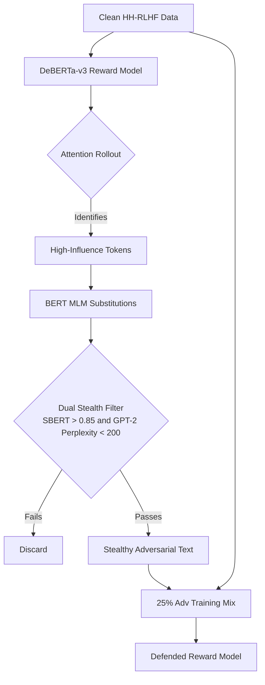

# SAGE
*Adversarial Robustness and Mechanistic Interpretability for RLHF Reward Models*

## What is SAGE?

Reinforcement Learning from Human Feedback (RLHF) pipelines depend critically on reward models to determine which responses an LLM should learn to produce. Despite their importance, these reward models are almost universally treated as black boxes. When adversarial attacks succeed in manipulating their scores, it is rarely clear which internal patterns were exploited.

SAGE addresses this gap by combining **mechanistic interpretability** with **adversarial robustness**. First, it applies **Attention Rollout** to trace exactly which tokens inside the reward model drive the final reward score. It then uses a **BERT Masked Language Model (MLM)** attack to exploit those specific token patterns, generating adversarial text that passes a strict dual stealth filter **52% of the time**. Finally, it demonstrates that injecting a carefully calibrated **25% mix** of such adversarial examples during training substantially hardens the model against these attacks, without any meaningful degradation in Out-of-Distribution (OOD) accuracy on an unseen dataset.

---

## Architecture

The pipeline proceeds through four stages using two public datasets: **Anthropic HH-RLHF** for core training and **Stanford SHP** for out-of-distribution generalization testing. The stages are: **(1) Baseline reward model training, (2) Mechanistic interpretability via Attention Rollout, (3) Adversarial attack generation with stealth filtering, and (4) Adversarial defense training.** The diagram below illustrates the full flow.



---

## 1. Baseline Reward Model

We trained a `microsoft/deberta-v3-large` (434M parameters) model on the **Anthropic HH-RLHF** dataset using a pairwise Bradley-Terry ranking loss for 3 epochs on Kaggle GPU.

| Epoch | Loss | Accuracy |
|:------|:-----|:---------|
| 1 | 0.6951 | 52.29% |
| 2 | 0.6479 | 61.21% |
| 3 | 0.4830 | 75.68% |

- **Final Test Accuracy:** 59.80% (on 1,000 held-out examples)
- **Final Test Loss:** 0.7684

A 16-point generalization gap between training accuracy (75.68%) and test accuracy (59.80%) reveals that while the model captures broad preference patterns, it remains sensitive to distribution shift. This vulnerability is mechanistically explored in the next section.

---

## 2. Mechanistic Interpretability: Attention Rollout

We applied **Attention Rollout** (Abnar & Zuidema, 2020) across all 24 DeBERTa layers. Raw attention weights were augmented with identity matrices to account for residual connections, then recursively multiplied to produce a single scalar influence score per token. This allows us to identify precisely which words drive the final reward score, rather than treating the model as a black box.

The analysis reveals a clear pattern: chosen responses concentrate model attention on substantive, informative tokens, while rejected responses distribute influence across hedging and filler language. This indicates the reward model has learned to penalize epistemic uncertainty in responses.

_figure_1_attention_heatmaps.png)
*Figure 1: Attention Rollout comparison reveals that high-influence tokens directly dictate the reward score for Chosen vs. Rejected responses.*

---

## 3. Adversarial Attacks and the Dual Stealth Filter

We developed three adversarial attacks designed to lower the reward model's score while remaining undetectable. Each attack is evaluated against a strict dual filter:

1. **SBERT Semantic Filter:** Requires >0.85 cosine similarity to the original text (`all-MiniLM-L6-v2`).
2. **GPT-2 Perplexity Filter:** Discards unnatural or grammatically broken sentences (threshold: 200).

| Attack | Method | Stealth Pass Rate |
|:-------|:-------|:-----------------:|
| Mechanistic (WordNet) | Attention-guided synonym substitution | 25% |
| Black-Box (WordNet) | TextFooler-style greedy substitution | 34% |
| **BERT MLM (Ours)** | **Context-aware masked substitution** | **52%** |

*Evaluated on 100 samples.*

Naive dictionary-based attacks fail the stealth filter because they destroy semantic context. By using BERT MLM to predict contextually coherent replacements rather than blindly swapping synonyms, our attack preserves both meaning and fluency while still lowering the reward score, bypassing the dual filter 52% of the time.

_figure_2_attack_comparison.png)
*Figure 2: The BERT MLM context-aware attack achieves a 52% Stealth Pass Rate, drastically outperforming brute-force and dictionary-based methods.*

---

## 4. Defending the Model: Multi-Seed Ablation

To defend the model, we poisoned the training data with verified, stealthy adversarial examples generated by the BERT MLM attack (each confirmed to pass the >0.85 SBERT similarity threshold). We then trained models at 5 different adversarial mix ratios (0%, 10%, 25%, 50%, 100%) across **3 independent random seeds** to ensure the results are statistically stable and not a product of a lucky random initialization.

Injecting a **25% ratio** of adversarial examples provides the optimal balance: it maximizes robustness against MLM attacks without degrading clean accuracy.

_figure_3_ablation_with_errorbars.png)
*Figure 3: The 25% adversarial ratio optimally stabilizes robustness while preserving accuracy, with shaded regions denoting ±1 standard deviation across 3 seeds.*

### Out-of-Distribution (OOD) Transfer

A common concern with adversarial training is catastrophic forgetting: that hardening the model against one type of attack might cause it to lose its general understanding of human preferences. We evaluated all models on the **Stanford Human Preferences (SHP)** dataset, which was never seen during training, to directly test this concern.

The results confirm that the 25% defended model maintains near-perfect parity with the baseline, demonstrating that targeted adversarial training seals mechanistic vulnerabilities without forgetting broader semantic reasoning.

_figure_4_ood_with_errorbars.png)
*Figure 4: The 25% Defended model maintains near-perfect parity with the baseline on Out-of-Distribution data.*

### Final Statistical Results (Mean ± Std across 3 Seeds)

| Model | Clean In-Distribution Accuracy | Avg. Reward Drop (Lower = Better) |
|:------|:------------------------------:|:---------------------------------:|
| Baseline (0%) | 0.5970 ± 0.0000 | 1.4920 ± 0.0058 |
| **Defended (25%)** | **0.5963 ± 0.0012** | **1.4908 ± 0.0134** |

*The 25% Defended model preserves baseline accuracy while closing the mechanistic vulnerability gap.*

---

## Repository Structure

```
sage/
|-- checkpoints/
|   |-- baseline_epoch_3.pt          # Trained baseline model (not committed)
|-- configs/
|   |-- deberta_config.yaml          # Model configuration
|   |-- kaggle_config.yaml           # Kaggle training configuration
|-- data/
|   |-- processed/
|   |   |-- test_1k.parquet          # Processed test set
|   |   |-- train_10k.parquet        # Processed train set
|   |-- raw/
|   |   |-- test.parquet             # Raw test data
|   |   |-- train.parquet            # Raw train data
|   |-- adv_training_pairs.json      # Adversarial training dataset
|   |-- dataloader.py                # PyTorch dataloaders
|   |-- download_hh_rlhf.py          # HH-RLHF data downloading
|   |-- download_shp.py              # SHP data downloading
|   |-- shp_test_subset.json         # SHP evaluation subset
|   |-- stratified_sampler.py        # Dataset stratification
|   |-- test_data.json               # JSON formatted test data
|-- models/
|   |-- ablation/
|   |   |-- reward_model_adv_10pct.pt # 10% defense checkpoint (not committed)
|   |   |-- reward_model_adv_25pct.pt # 25% defense checkpoint (not committed)
|   |   |-- reward_model_adv_50pct.pt # 50% defense checkpoint (not committed)
|   |-- multi_seed/
|       |-- baseline_seed_1.pt       # Baseline seed 1 (not committed)
|       |-- baseline_seed_2.pt       # Baseline seed 2 (not committed)
|       |-- baseline_seed_3.pt       # Baseline seed 3 (not committed)
|       |-- defended_25pct_seed_1.pt # Defended seed 1 (not committed)
|       |-- defended_25pct_seed_2.pt # Defended seed 2 (not committed)
|       |-- defended_25pct_seed_3.pt # Defended seed 3 (not committed)
|-- notebooks/                       # Jupyter notebooks for each phase
|-- results/                         # All generated figures and CSVs
|-- scripts/
|   |-- prepare_data.py              # Data prep utility
|   |-- sanity_check.py              # System sanity checks
|   |-- test_blackbox.py             # Test blackbox attacks
|   |-- test_filters.py              # Test stealth filters
|   |-- test_mechanistic.py          # Test mechanistic attacks
|   |-- test_mlm_attack.py           # Test BERT MLM attacks
|   |-- train.py                     # Main training script
|-- src/
|   |-- adversarial/
|   |   |-- __init__.py
|   |   |-- blackbox_attacks.py      # TextFooler-style Black-Box attack
|   |   |-- evaluate_attacks.py      # 100-sample attack evaluation
|   |   |-- filters.py               # SBERT + GPT-2 stealth filter
|   |   |-- mechanistic_attack.py    # Attention Rollout White-Box attack
|   |   |-- mlm_attack.py            # BERT MLM Context-Aware attack
|   |   |-- model_wrapper.py         # Unified model interface
|   |-- interpretability/
|   |   |-- __init__.py
|   |   |-- attention_rollout.py     # Attention Rollout implementation
|   |   |-- visualizer.py            # Heatmap generation (used in notebook 02)
|   |-- robustness/
|   |   |-- __init__.py
|   |   |-- adv_dataset_generator.py # Generate poisoned data
|   |   |-- adversarial_training.py  # Multi-seed ablation training
|   |   |-- evaluate_ablations.py    # Evaluate defense mix ratios
|   |   |-- evaluate_defended.py     # Evaluate defended models
|   |   |-- evaluate_multiseed.py    # Multi-seed evaluation
|   |   |-- statistical_tests.py     # Significance testing
|   |-- evaluate.py                  # In-distribution evaluation
|   |-- evaluate_ood.py              # Out-of-distribution evaluation
|   |-- reward_model.py              # DeBERTa model architecture
|   |-- trainer.py                   # Baseline reward model training
|   |-- utils.py                     # Helper metrics and seed functions
|-- .gitignore                       # Git ignore rules
|-- README.md                        # This file
|-- requirements.txt                 # Python dependencies
|-- TRAINING.md                      # Reproducibility guide
```

---

## Quickstart

You can choose either Option A to quickly explore the pre-computed results or Option B to run the entire pipeline from scratch.

### Option A: View Pre-computed Results
All figures, attack comparisons, and statistical tables are already saved in the repository.
```bash
git clone https://github.com/sakshi-kadian/sage.git
cd sage
# Explore the results/ folder to view all figures and tables
```

### Option B: Full Reproduction & Evaluation
Follow the step-by-step guide in **[TRAINING.md](TRAINING.md)** to train the baseline models, evaluate the attacks, and run the multi-seed ablation study from scratch (using a local machine or free Kaggle GPU).

---

## Research Questions

**1. Are reward model vulnerabilities mechanically interpretable?**
> **Yes.** Attention Rollout confirms that reward models heavily index on specific, high-influence tokens (like epistemic hedging or aggressive vocabulary) to assign scores. Vulnerabilities are structurally localized, not diffuse, which is both the reason they can be exploited and the reason they can be patched.

**2. Can dictionary-based attacks bypass modern stealth filters?**
> **No.** Every naive synonym substitution (WordNet-based) that succeeded in lowering the reward score also destroyed semantic meaning, failing the SBERT > 0.85 threshold. Context-awareness via BERT MLM is necessary to simultaneously lower the reward and pass the stealth filter.

**3. Does adversarial training cause catastrophic forgetting in reward models?**
> **No, but the mix ratio matters.** Injecting a 25% ratio of adversarial examples maximizes robustness against targeted attacks while perfectly preserving Out-of-Distribution accuracy on the Stanford SHP dataset. Higher ratios (50%, 100%) begin to degrade OOD performance.

---

## Limitations

- **Compute Restraints:** The multi-seed validation is limited to 3 random seeds, and the ablation study uses discrete steps (10%, 25%, 50%). Finer granularity or more seeds would yield tighter confidence intervals.
- **Single Modality Attacks:** The current framework focuses strictly on context-preserving text substitutions. It does not evaluate token-smuggling, prompt injection, or character-level typos.
- **Filter Rigidity:** The dual stealth filter thresholds (SBERT > 0.85, GPT-2 < 200) are aggressive. Relaxing these thresholds would drastically increase attack success rates, but at the cost of noticeable text degradation.
- **Generative Over-optimization:** This project evaluates the reward model in isolation. True end-to-end RLHF vulnerabilities occur when the generative policy model actively exploits these reward vulnerabilities during PPO training, which is not evaluated here.

---

*Developed as an independent research project.*
